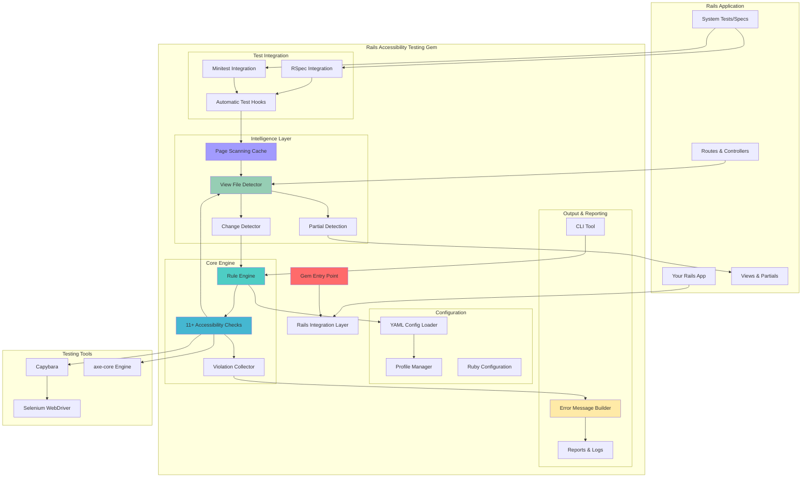
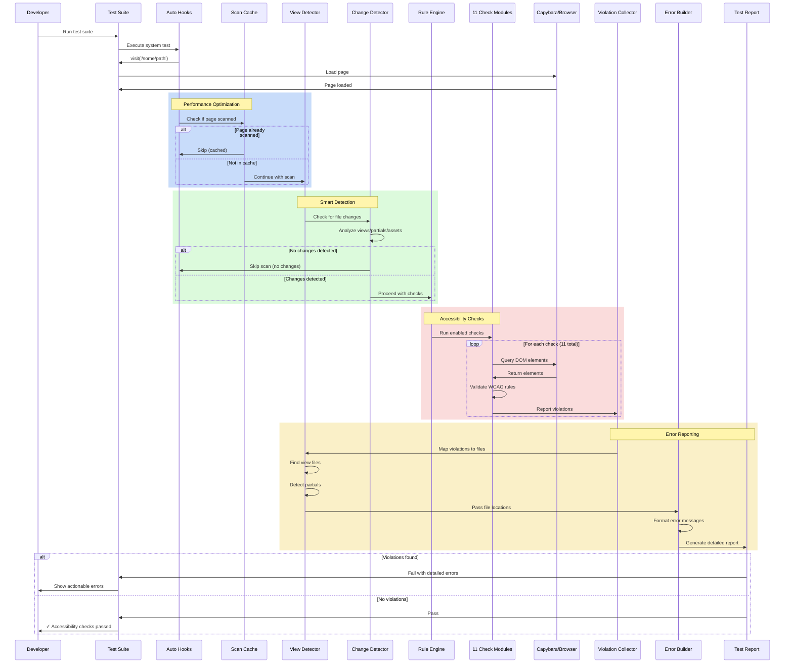
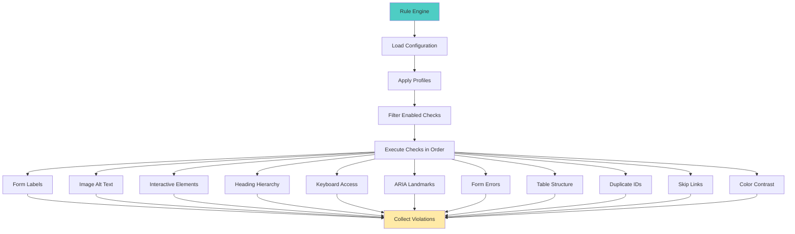
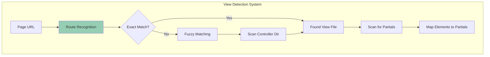
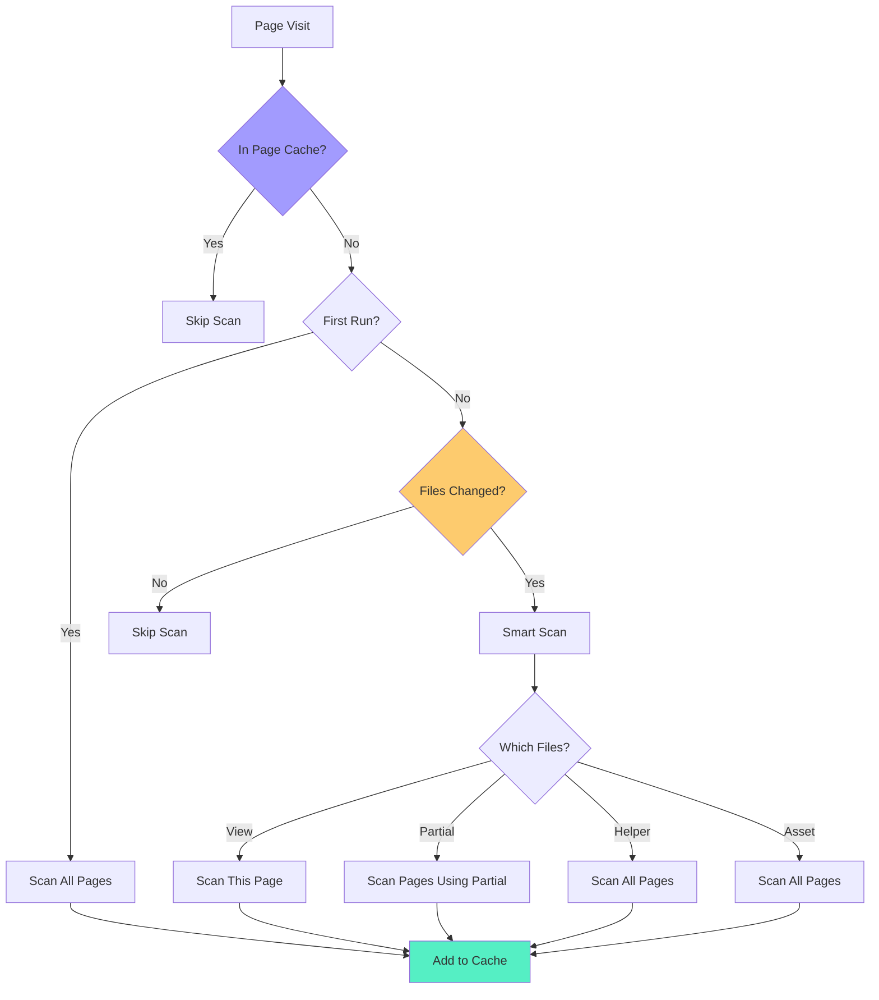

# Rails Accessibility Testing Gem - Architecture Overview

## Project Identity

### Gem Name

**Final Name: `rails_accessibility_testing`**

**Note:** The gem uses `rails_a11y` as a short alias for the generator command and CLI tool, but the official gem name is `rails_accessibility_testing`.

### Tagline

**"The RSpec + RuboCop of accessibility for Rails. Catch WCAG violations before they reach production."**

### Positioning Statement

Rails Accessibility Testing fills a critical gap in the Rails testing ecosystem. While RSpec ensures code works and RuboCop ensures code style, Rails Accessibility Testing ensures applications are accessible to everyone. Unlike manual accessibility audits that happen late in development, Rails Accessibility Testing integrates directly into your test suite, catching violations as you code. It's opinionated enough to guide teams new to accessibility, yet configurable enough for experienced teams. By making accessibility testing as natural as unit testing, Rails Accessibility Testing helps teams build accessible applications from day one, not as an afterthought.

---

## Architecture Overview

### Core Principles

1. **DevX First**: Every feature prioritizes developer experience
2. **Accessibility at Core**: WCAG 2.1 AA compliance is the foundation
3. **Rails Native**: Feels like a natural part of Rails, not a bolt-on
4. **Progressive Enhancement**: Works with zero config, scales with configuration
5. **Performance Conscious**: Smart caching and change detection for fast feedback

### Component Architecture

```
rails_accessibility_testing/
├── Core Engine
│   ├── Rule Engine          # Evaluates accessibility rules
│   ├── Check Definitions    # WCAG-aligned check implementations (11+ checks)
│   └── Violation Collector  # Aggregates and formats violations
│
├── View Detection System (NEW in 1.5.0)
│   ├── View File Detector   # Finds view files from routes/actions
│   ├── Partial Detection    # Scans view files for rendered partials
│   ├── Route Recognition    # Maps URLs to controller/action pairs
│   └── Fuzzy Matching       # Handles action/view name mismatches
│
├── Performance System (NEW in 1.5.0)
│   ├── Page Scanning Cache  # Prevents duplicate scans
│   ├── Change Detector      # Detects file changes and impact
│   ├── First-Run Logic      # Optimizes initial vs subsequent runs
│   └── Asset Change Detection # Tracks CSS/JS changes
│
├── Rails Integration
│   ├── Railtie             # Rails initialization hooks
│   ├── RSpec Integration    # RSpec helpers and matchers
│   ├── Minitest Integration # Minitest helpers
│   └── System Test Helpers  # Capybara integration
│
├── Configuration
│   ├── YAML Config Loader   # Loads config/accessibility.yml
│   ├── Profile Manager      # Dev/test/CI profiles
│   └── Rule Overrides       # Ignore rules with comments
│
├── CLI
│   ├── Command Runner       # Main CLI entry point
│   ├── URL Scanner          # Scans URLs/routes
│   └── Report Generator     # Human-readable + JSON reports
│
├── Generators
│   └── Install Generator    # Rails generator for setup
│
└── Documentation
    ├── Guides/              # Practical guides
    ├── API Docs (YARD)      # Generated documentation
    └── Doc Site             # Static documentation site
```

#### Visual Architecture Diagram



### Data Flow

```
Test Execution
    ↓
System Test Helper (RSpec/Minitest)
    ↓
Page Scanning Cache Check (NEW in 1.5.0)
    ↓ (if not cached)
Rule Engine
    ↓
Check Definitions (11+ checks)
    ↓
View File Detection (NEW in 1.5.0)
    ├── Route Recognition
    ├── View File Matching
    └── Partial Detection
    ↓
Violation Collector
    ↓
Error Message Builder (with file paths)
    ↓
Test Failure / CLI Report
```

#### Request Flow Sequence Diagram



### Rule Engine Design

The rule engine is the heart of the gem. It:

1. **Loads Configuration**: Reads `config/accessibility.yml` with profile support
2. **Applies Rule Overrides**: Respects ignored rules with comments
3. **Executes Checks**: Runs enabled checks in order
4. **Collects Violations**: Aggregates all violations before reporting
5. **Formats Output**: Creates actionable error messages with precise file locations

#### Rule Engine Flow Diagram



### Check Definition Structure

Each check is a self-contained class that:

- Implements a standard interface (`BaseCheck`)
- Returns violations with context
- Includes WCAG references
- Provides remediation suggestions
- Can be enabled/disabled via config
- **NEW in 1.5.0**: Includes partial detection methods for better file location

### View Detection System (NEW in 1.5.0)

The view detection system is a major enhancement that makes error messages much more actionable:

#### View File Detection

1. **Route Recognition**: Uses `Rails.application.routes.recognize_path` to get controller/action
2. **Exact Matching**: First tries exact match (`controller/action.html.erb`)
3. **Fuzzy Matching**: If no exact match, scans controller directory for files containing action name
4. **Preference Logic**: Prefers files starting with action name (e.g., `search_result.html.erb` for `search` action)
5. **Fallback**: If controller has only one view file, uses that

#### Partial Detection

1. **Pattern Scanning**: Scans view file content for `render` statements using multiple regex patterns
2. **Normalization**: Handles various render syntaxes (`render 'partial'`, `render partial: 'partial'`, ERB syntax)
3. **Path Resolution**: Resolves partial paths (handles namespaced partials like `layouts/navbar`)
4. **Multi-Location Search**: Searches in controller directory, `shared/`, and `layouts/`
5. **Element Mapping**: When an accessibility issue is found, determines if it's in a partial

#### Module Structure

```ruby
module AccessibilityHelper
  module PartialDetection
    # Reusable partial detection methods
    def find_partials_in_view_file(view_file)
      # Scans view file for render statements
    end
    
    def find_partial_for_element_in_list(controller, element_context, partial_list)
      # Maps element to specific partial
    end
  end
end
```

#### View Detection Flow Diagram



### Performance System (NEW in 1.5.0)

#### Page Scanning Cache

- **Purpose**: Prevents duplicate accessibility scans of the same page
- **Implementation**: Module-level `@scanned_pages` hash
- **Key Strategy**: Uses page path (preferred) or URL as cache key
- **Lifecycle**: Persists for duration of test suite execution
- **API**: `reset_scanned_pages_cache` for manual reset

#### Change Detection

- **Purpose**: Only test pages when relevant files have changed
- **Monitored Files**: Views, controllers, helpers, CSS, JavaScript
- **Impact Analysis**: 
  - Main layouts → affects all pages
  - Specific partials → affects only pages that render them
  - Controllers → affects all routes for that controller
  - Helpers → affects all pages (can be used anywhere)
  - Assets → affects all pages (global impact)

#### First-Run Logic

- **Marker File**: `.rails_a11y_initialized` tracks first run
- **Initial Run**: Tests all pages to establish baseline
- **Subsequent Runs**: Only tests changed files
- **Force Option**: `TEST_ALL_PAGES=true` environment variable

#### Performance Optimization Flow



---

## Key Design Decisions

### 1. YAML Configuration

**Why YAML?** 
- Human-readable and comment-friendly
- Easy to version control
- Familiar to Rails developers
- Supports profiles (dev/test/CI)

### 2. Rule-Based Architecture

**Why separate rules?**
- Easy to enable/disable specific checks
- Allows teams to gradually adopt stricter rules
- Makes it easy to add custom rules later
- Clear separation of concerns

### 3. Violation Collection vs Immediate Failure

**Why collect then fail?**
- Shows all issues at once (better DX)
- Allows prioritization
- More efficient than stopping at first error
- Better for CI/CD reports

### 4. View File Detection (Enhanced in 1.5.0)

**Why detect view files?**
- Points developers to exact file to fix
- Works with partials and layouts
- Reduces debugging time
- Makes errors actionable
- **NEW**: Handles action/view name mismatches
- **NEW**: Detects partials automatically

### 5. Page Scanning Cache (NEW in 1.5.0)

**Why cache scanned pages?**
- Prevents duplicate work
- Faster test execution
- Better developer experience
- Reduces unnecessary browser automation

### 6. Smart Change Detection (Enhanced in 1.5.0)

**Why detect changes?**
- Only test what changed (faster feedback)
- Reduces test execution time
- Better CI/CD performance
- **NEW**: Detects asset changes (CSS/JS)
- **NEW**: Smart partial impact analysis

### 7. Dual Test Framework Support

**Why both RSpec and Minitest?**
- Rails teams use both
- Reduces friction for adoption
- Shared core logic, different interfaces
- Better market fit

---

## File Structure

```
lib/
├── rails_accessibility_testing.rb                    # Main entry point
├── rails_accessibility_testing/
│   ├── version.rb
│   ├── configuration.rb             # Config management
│   ├── railtie.rb                   # Rails integration
│   │
│   ├── engine/
│   │   ├── rule_engine.rb           # Core rule evaluator
│   │   ├── violation_collector.rb  # Aggregates violations
│   │   └── violation.rb            # Violation data structure
│   │
│   ├── checks/
│   │   ├── base_check.rb           # Base class for all checks
│   │   │                            # (includes PartialDetection in 1.5.0)
│   │   ├── form_labels_check.rb
│   │   ├── image_alt_text_check.rb
│   │   ├── interactive_elements_check.rb
│   │   ├── heading_check.rb        # Renamed from heading_hierarchy_check
│   │   ├── keyboard_accessibility_check.rb
│   │   ├── aria_landmarks_check.rb
│   │   ├── form_errors_check.rb
│   │   ├── table_structure_check.rb
│   │   ├── duplicate_ids_check.rb
│   │   ├── skip_links_check.rb
│   │   └── color_contrast_check.rb
│   │
│   ├── accessibility_helper.rb      # Main helper module
│   │                                # (includes PartialDetection, page cache)
│   │
│   ├── change_detector.rb          # Smart change detection
│   │                                # (enhanced in 1.5.0 for assets/partials)
│   │
│   ├── integration/
│   │   ├── rspec_integration.rb
│   │   ├── minitest_integration.rb
│   │   └── system_test_helper.rb   # Shared Capybara helpers
│   │
│   ├── cli/
│   │   └── command.rb              # Main CLI command
│   │
│   ├── config/
│   │   └── yaml_loader.rb         # Loads YAML config
│   │
│   ├── error_message_builder.rb   # Formats error messages
│   │                                # (enhanced with partial detection in 1.5.0)
│   │
│   └── middleware/
│       └── page_visit_logger.rb
│
├── generators/
│   └── rails_a11y/
│       └── install/
│           ├── install_generator.rb
│           └── templates/
│               ├── initializer.rb.erb
│               ├── accessibility.yml.erb
│               └── all_pages_accessibility_spec.rb.erb
│               # (enhanced in 1.5.0 with dynamic route discovery)
│
└── tasks/
    └── accessibility.rake

exe/
├── rails_a11y                    # CLI executable
├── rails_server_safe             # Safe server wrapper (NEW in 1.5.0)
└── a11y_live_scanner            # Live scanner tool

GUIDES/
├── getting_started.md
├── continuous_integration.md
├── working_with_designers_and_content_authors.md
└── writing_accessible_views_in_rails.md

docs_site/
├── index.html
├── getting_started.md
├── configuration.md
└── ci_integration.md
```

---

## Extension Points

### Adding Custom Checks

```ruby
module RailsAccessibilityTesting
  module Checks
    class CustomCheck < BaseCheck
      def self.rule_name
        :custom_check
      end
      
      def check
        violations = []
        # Implementation
        # Access to page, context, and partial detection methods
        violations
      end
    end
  end
end
```

### Custom Error Formatters

```ruby
module RailsAccessibilityTesting
  class CustomFormatter
    def format(violation)
      # Custom formatting logic
      # Access to violation.element_context, violation.page_context
    end
  end
end
```

### Profile-Specific Configuration

```yaml
# config/accessibility.yml
development:
  checks:
    color_contrast: false  # Skip in dev for speed

ci:
  checks:
    color_contrast: true   # Full checks in CI
```

---

## Performance Considerations

1. **Lazy Loading**: Checks loaded only when needed
2. **Caching**: 
   - View file detection cached (implicit)
   - **Page scanning cache** (NEW in 1.5.0): Prevents duplicate scans
3. **Selective Execution**: 
   - Only run checks for changed files (existing feature)
   - **Smart change detection** (enhanced in 1.5.0)
4. **Configurable Depth**: Expensive checks behind flags (color contrast)
5. **Parallel Execution**: Checks can run in parallel (future)

---

## Testing Strategy

1. **Unit Tests**: Each check tested in isolation
2. **Integration Tests**: Full Rails app with RSpec/Minitest
3. **CLI Tests**: Test CLI against real Rails routes
4. **Documentation Tests**: Ensure examples work
5. **Performance Tests**: Verify caching and change detection work correctly

---

## Version 1.5.0 Highlights

### New Components

1. **PartialDetection Module**: Reusable partial detection logic
2. **Page Scanning Cache**: Module-level cache for scanned pages
3. **Enhanced ChangeDetector**: Asset change detection and smart partial impact analysis
4. **Improved View File Detection**: Fuzzy matching and controller directory scanning
5. **Rails Server Safe Wrapper**: Prevents Foreman from terminating processes

### Enhanced Components

1. **BaseCheck**: Now includes PartialDetection for better file location
2. **AccessibilityHelper**: Includes page cache and partial detection
3. **ErrorMessageBuilder**: Shows partial files in error messages
4. **Generator Templates**: Dynamic route discovery and first-run logic
5. **ChangeDetector**: Asset detection and improved partial impact analysis

### Performance Improvements

1. **Page Scanning Cache**: Eliminates duplicate scans
2. **Smart Change Detection**: Only tests affected pages
3. **First-Run Optimization**: Faster initial setup
4. **Reduced Wait Times**: Faster Capybara operations

---

## Future Enhancements

1. **Custom Rules**: Allow teams to define custom checks
2. **Visual Regression**: Screenshot comparison for visual issues
3. **Performance Monitoring**: Track check performance
4. **IDE Integration**: VS Code/IntelliJ plugins
5. **CI/CD Templates**: Pre-built GitHub Actions, CircleCI configs
6. **Parallel Check Execution**: Run checks in parallel for faster results
7. **Incremental Reports**: Show only new issues since last run

---

## Migration Guide

### From 1.4.x to 1.5.0

1. **No breaking changes**: Fully backward compatible
2. **Automatic benefits**: Existing installations get improved view detection automatically
3. **Generator update**: Re-run `rails generate rails_a11y:install` to get latest spec template
4. **CSV gem**: If using Ruby 3.3+, add `gem 'csv'` to Gemfile (generator handles this)
5. **Config update**: `heading_hierarchy` renamed to `heading` in config (backward compatible)

---

**Architecture Version**: 1.5.0  
**Last Updated**: 2025-11-19
