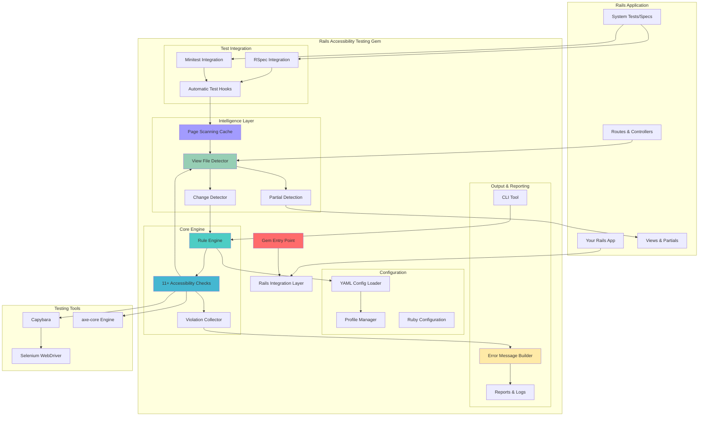
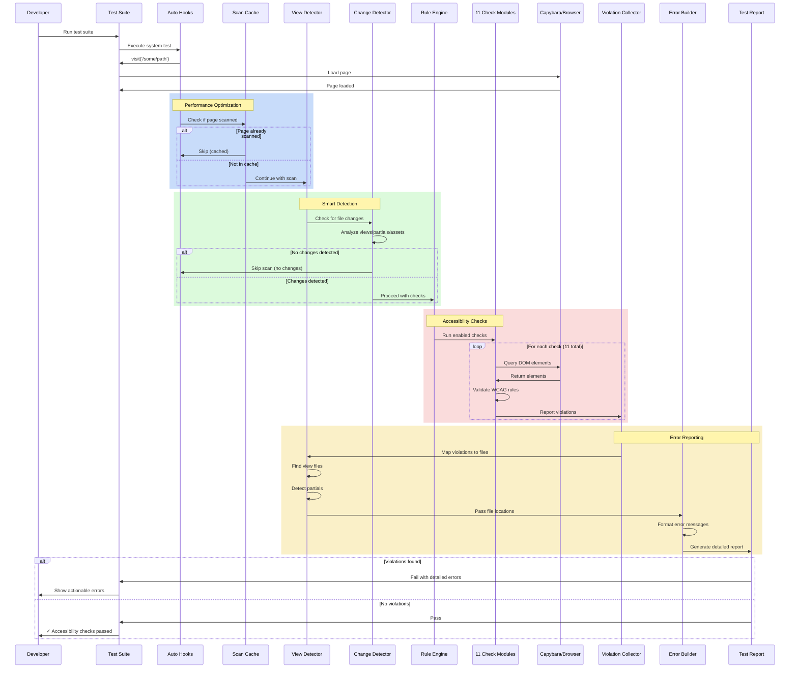
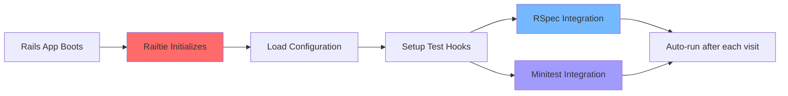
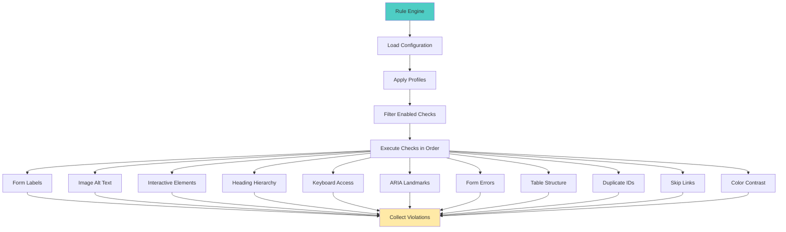
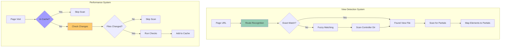
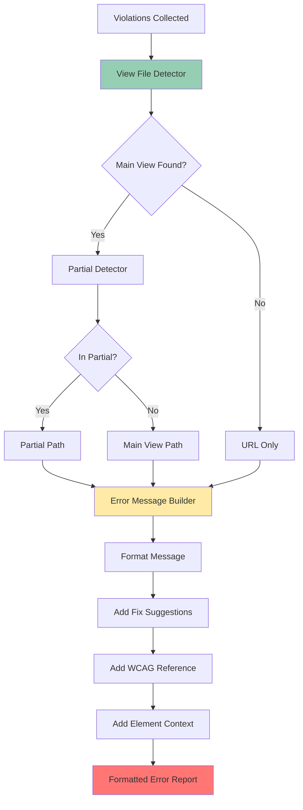
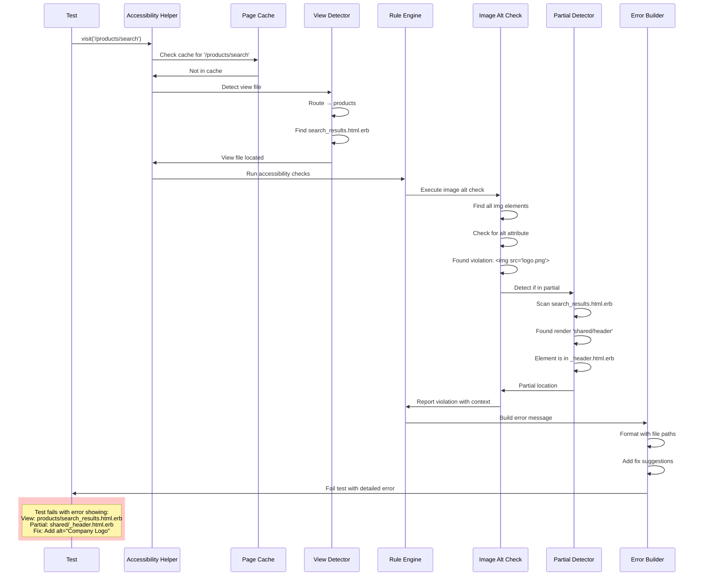
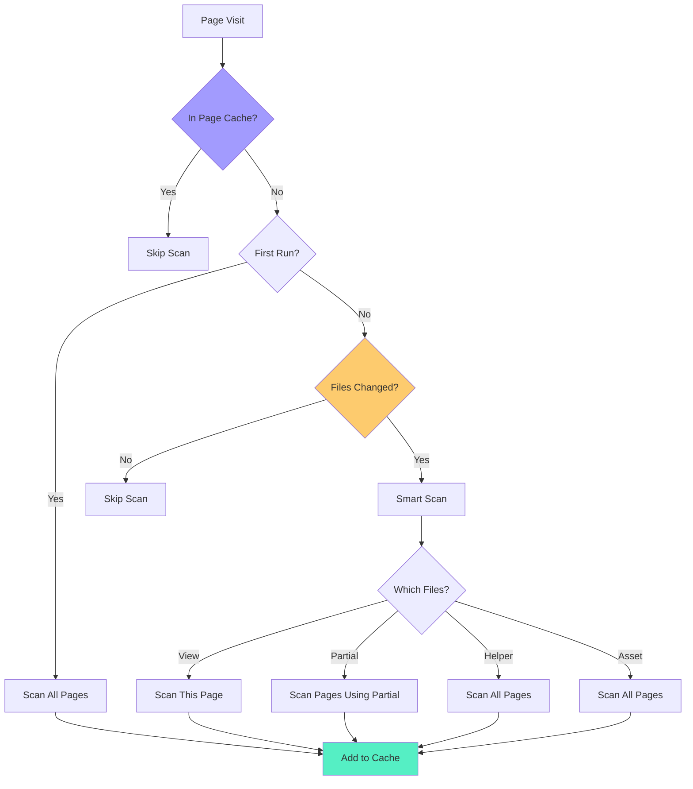
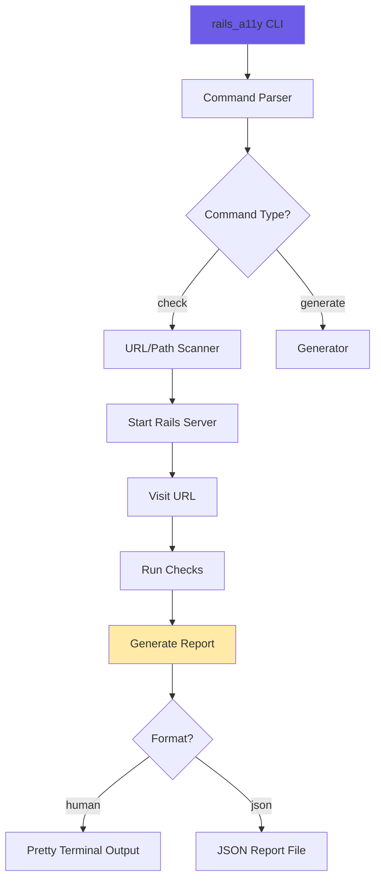

# Architecture Overview

This page provides visual diagrams and explanations of how the Rails Accessibility Testing gem works internally.

---

## High-Level System Architecture

The gem integrates seamlessly into your Rails application through multiple layers:



---

## Request Flow - How It Works

This sequence diagram shows the complete flow when a test runs:



---

## Core Components

### 1. Entry & Integration Layer

The gem integrates with Rails through the Railtie system and automatically hooks into your test framework:



**Key Files:**
- `railtie.rb` - Rails initialization
- `rspec_integration.rb` - RSpec auto-hooks
- `integration/minitest_integration.rb` - Minitest helpers

---

### 2. Core Rule Engine

The rule engine orchestrates all accessibility checks:



**Key Features:**
- Profile-based configuration (dev/test/ci)
- Individual check enable/disable
- WCAG 2.1 AA aligned checks
- Violation aggregation

---

### 3. Intelligence Layer (v1.5.0+)

Smart detection and performance optimization:



**Key Features:**
- **View File Detection**: Finds exact view file from URL
- **Partial Detection**: Maps issues to specific partials
- **Change Detection**: Only tests modified pages
- **Page Cache**: Prevents duplicate scans

---

### 4. Error Reporting System

Generate actionable error messages with precise file locations:



**Error Report Includes:**
- Page URL and path
- View file and partial location
- Element details (tag, ID, classes)
- Fix suggestions with code examples
- WCAG 2.1 reference links

---

## Data Flow Example

### Scenario: Detecting an Image Without Alt Text



---

## Performance Optimization

### Caching & Change Detection Strategy



### Impact Analysis

Different file changes have different impacts:

| File Type | Impact | Action |
|-----------|--------|--------|
| Main View | Single page | Test that page only |
| Partial | Multiple pages | Test all pages using partial |
| Controller | Controller routes | Test all routes for controller |
| Helper | Global | Test all pages |
| CSS/JS | Global | Test all pages |
| Layout | Global | Test all pages |

---

## CLI Architecture

Command-line scanning for standalone usage:



**Commands:**
- `check` - Scan URLs or routes
- `--format json` - Generate JSON reports
- `--profile ci` - Use specific profile

---

## Extension Points

### Adding Custom Checks

The gem is designed to be extensible:

```ruby
# lib/custom_checks/my_check.rb
module RailsAccessibilityTesting
  module Checks
    class MyCustomCheck < BaseCheck
      def self.rule_name
        :my_custom_check
      end
      
      def check
        violations = []
        # Your check logic here
        # Access: page, context, partial detection
        violations
      end
    end
  end
end
```

---

## Key Design Patterns

### 1. Modular Check System

Each check is self-contained and independently configurable.

### 2. Progressive Enhancement

- **Level 1**: Just add gem → automatic checks
- **Level 2**: Configure via YAML → customize checks  
- **Level 3**: Profiles → environment-specific configs
- **Level 4**: Custom checks → extend functionality

### 3. Smart Caching & Detection

Performance optimizations that work transparently:
- Page cache prevents duplicate scans
- Change detection only tests modified files
- First-run establishes baseline, then incremental

### 4. Developer Experience First

Every feature prioritizes DX:
- Automatic hooks (zero configuration)
- Detailed errors (exact file locations)
- Fix suggestions (code examples)
- Beautiful output (color-coded reports)

---

## Summary

The Rails Accessibility Testing gem provides:

✅ **Seamless Integration** - Auto-hooks into Rails test suite  
✅ **Intelligent Detection** - Finds exact files to fix  
✅ **Performance Optimized** - Smart caching and change detection  
✅ **Developer Friendly** - Detailed errors with fix suggestions  
✅ **Highly Configurable** - Profile-based configuration  
✅ **Extensible** - Easy to add custom checks  
✅ **Production Ready** - Comprehensive WCAG 2.1 AA checks  

---

**For more details, see the [ARCHITECTURE.md](https://github.com/rayraycodes/rails-accessibility-testing/blob/main/ARCHITECTURE.md) file in the repository.**

**Version**: 1.5.0  
**Last Updated**: 2025-11-20
