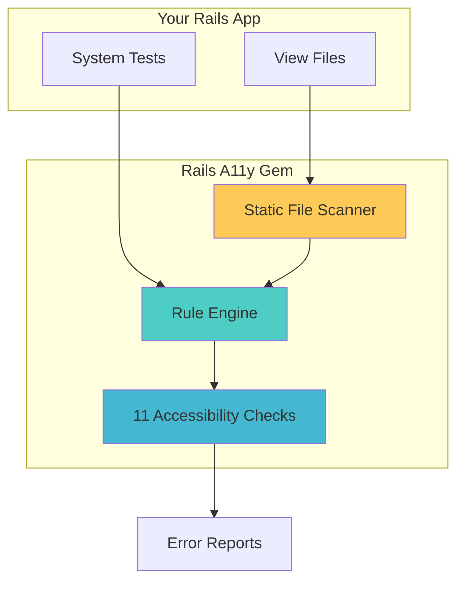
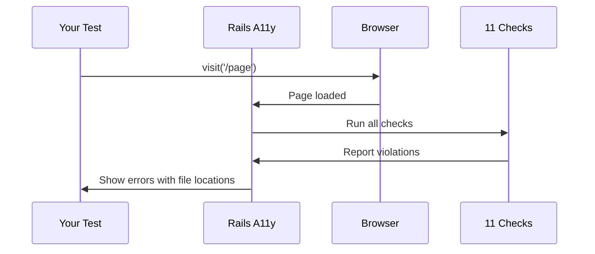
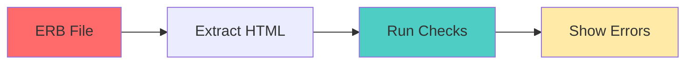
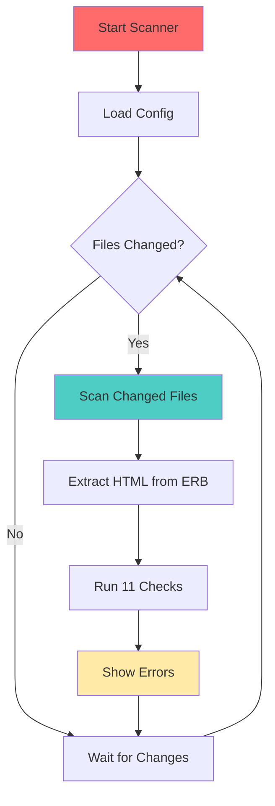

# Architecture Overview

Simple visual guide to how Rails Accessibility Testing works.

---

## How It Works

The gem integrates into your Rails app and automatically checks accessibility:



---

## Two Ways to Scan

### 1. System Tests (Browser-Based)

Runs automatically when you visit pages in tests:



### 2. Static Scanner (File-Based) ⭐ Recommended

Scans ERB files directly - faster, no browser needed:



**Benefits:**
- ⚡ 10-100x faster than browser-based
- 📍 Shows exact file and line number
- 🔄 Runs continuously in `bin/dev`
- 🎯 Only scans changed files

---

## Static Scanner Flow

How the static scanner works:



---

## What Gets Checked

The gem runs **11 accessibility checks**:

1. Form Labels
2. Image Alt Text
3. Interactive Elements
4. Heading Hierarchy
5. Keyboard Accessibility
6. ARIA Landmarks
7. Form Errors
8. Table Structure
9. Duplicate IDs
10. Skip Links
11. Color Contrast

All checks are WCAG 2.1 AA aligned.

---

## Configuration

Everything is configured via `config/accessibility.yml`:

```yaml
# Enable/disable checks
checks:
  form_labels: true
  image_alt_text: true
  color_contrast: false  # Disabled by default (slow)

# Static scanner settings
static_scanner:
  scan_changed_only: true    # Only scan changed files
  full_scan_on_startup: true  # Full scan on startup
  check_interval: 3          # Seconds between checks

# Summary settings
summary:
  ignore_warnings: false  # Hide warnings, only show errors
```

---

## Key Components

### Static Scanner Components

1. **StaticFileScanner** - Main orchestrator
2. **FileChangeTracker** - Tracks which files changed
3. **ErbExtractor** - Converts ERB to HTML
4. **StaticPageAdapter** - Makes HTML work with checks
5. **LineNumberFinder** - Maps errors to line numbers
6. **ViolationConverter** - Formats results

All components work together to scan files and report errors with exact locations.

---

## Summary

✅ **Automatic** - Runs automatically in tests  
✅ **Fast** - Static scanner is 10-100x faster  
✅ **Precise** - Shows exact file and line number  
✅ **Configurable** - Control via YAML  
✅ **Simple** - Just add gem and run tests  

**Version**: 1.5.5
