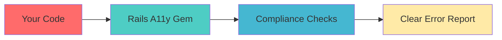
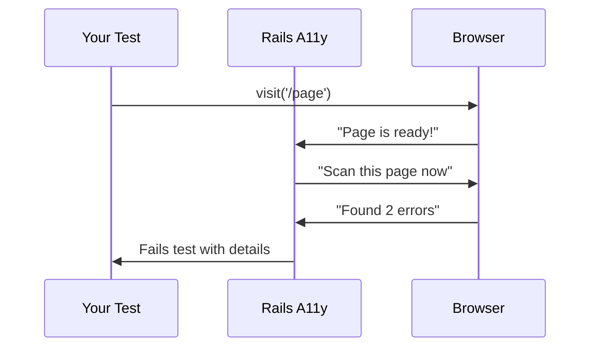
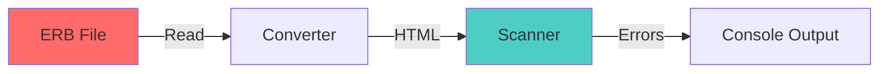
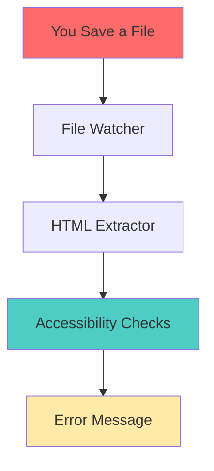

# Architecture

## Composed Page Scanning

The gem now uses **composed page scanning** for page-level accessibility checks. This ensures that checks like heading hierarchy, ARIA landmarks, and duplicate IDs are evaluated against the complete rendered page (layout + view + partials), not individual files.

### View Composition Builder

The `ViewCompositionBuilder` class traces the complete page structure:

1. **Finds Layout File**: Identifies the layout file (defaults to `application.html.erb`)
2. **Finds View File**: The main view file being rendered
3. **Recursively Finds Partials**: Discovers all partials rendered in the view, including:
   - Partials in the same directory
   - Partials in `layouts/`, `shared/`, `application/`
   - Partials in any subdirectory (exhaustive search)
   - Nested partials (partials within partials)

### Partial Detection

The gem detects all Rails render patterns:
- `render 'partial'`
- `render partial: 'partial'`
- `render @model` (Rails shorthand)
- `render collection: @models`
- `render partial: 'item', collection: @items`
- `render partial: 'form', locals: {...}`

### Exhaustive Folder Traversal

The partial search traverses ALL folders in `app/views` recursively using `Dir.glob`, ensuring partials are found regardless of their location:
- `app/views/collections/`
- `app/views/collections/collection_questions/`
- `app/views/items/`
- `app/views/profiles/`
- `app/views/loan_requests/`
- Any other nested structure

This makes it a general solution that works for any Rails application structure. Overview

This guide explains how Rails Accessibility Testing works under the hood in simple terms.

---

## The Big Picture

The gem sits between your **Rails Application** and standard accessibility tools (like **axe-core**). It acts as a bridge that automatically checks your code for issues.

### Core Concept

1. **You run a test** (or the static scanner watches your files).
2. **The Gem activates** and scans the content.
3. **11 Checks run** to find accessibility violations.
4. **Errors are reported** with the exact file and line number to fix.

---

## Two Ways to Scan

The gem provides two main ways to check your application. Both share the same "brain" (the Rule Engine) but work differently.

### 1. System Tests (Browser-Based)

This is the most accurate method. It runs while your standard Rails system tests (RSpec/Minitest) are executing.

*   **When it runs:** Automatically when you visit a page in a test (`visit root_path`).
*   **What it does:** It looks at the *rendered* page in the browser (Chrome/Chromium).
*   **Best for:** Finding issues that only appear after JavaScript runs or CSS is applied.

### 2. Static Scanner (File-Based)

This is the fast method for development. It scans your source code files directly without opening a browser.

*   **When it runs:** Continuously in the background (via `bin/dev`) or manually.
*   **What it does:** Reads your `.html.erb` files, converts them to HTML, and checks them.
*   **Best for:** Instant feedback as you type code.

---

## Key Components

Here are the main parts of the gem and what they do:

### 🧠 The Rule Engine
The "brain" of the operation. It:
- Reads your configuration (`config/accessibility.yml`).
- Decides which checks to run.
- Coordinates the checking process.

### 🕵️ The Checks
There are **11 specialized agents**, each looking for a specific type of problem:
1.  **Form Labels** (Do inputs have labels?)
2.  **Image Alt Text** (Do images have descriptions?)
3.  **Headings** (Is the document structure logical?)
4.  **Color Contrast** (Is text readable?)
5.  ...and 7 others.

### 📍 View Detector
This smart component figures out **where** the error came from.
- If an error is found on a page, it traces it back to the exact View file (`app/views/...`) or Partial (`_form.html.erb`) that generated it.

### ⚡ Performance System
To keep your tests fast, the gem uses:
- **Caching:** Remembers pages it has already scanned so it doesn't scan them twice.
- **Change Detection:** In the static scanner, it only checks files that you have modified.

---

## How Static Scanning Works (Simplified)

The static scanner is a "pipeline" that transforms your Ruby code into something we can test.

1.  **Watch:** It watches your file system for changes.
2.  **Extract:** When you save a file, it pulls out the HTML and standardizes Rails helpers (like converting `link_to` to `<a href...>`).
3.  **Test:** It runs the standard accessibility checks on this "virtual" page.
4.  **Report:** If it finds issues, it maps them back to the line number in your original file.

---

## Configuration & Profiles

You can change how the gem behaves using **Profiles**.

*   **Development Profile:** 
    *   Optimized for speed.
    *   Skips slow checks (like color contrast).
    *   Runs on changed files only.
*   **CI (Continuous Integration) Profile:**
    *   Optimized for thoroughness.
    *   Runs ALL checks (including strict ones).
    *   Ensures zero violations before merging code.

Configuration happens in `config/accessibility.yml`.

---

## Directory Structure

Quick map of where important things live in the gem:

- **`lib/rails_accessibility_testing/checks/`**: The 11 individual accessibility rules.
- **`lib/rails_accessibility_testing/engine/`**: The logic that runs the checks.
- **`lib/rails_accessibility_testing/static_file_scanner.rb`**: The file-based scanning logic.
- **`exe/`**: Command line tools (like `rails_a11y`).

---

*This architecture is designed to be invisible when it works, and helpful when it finds problems.*
